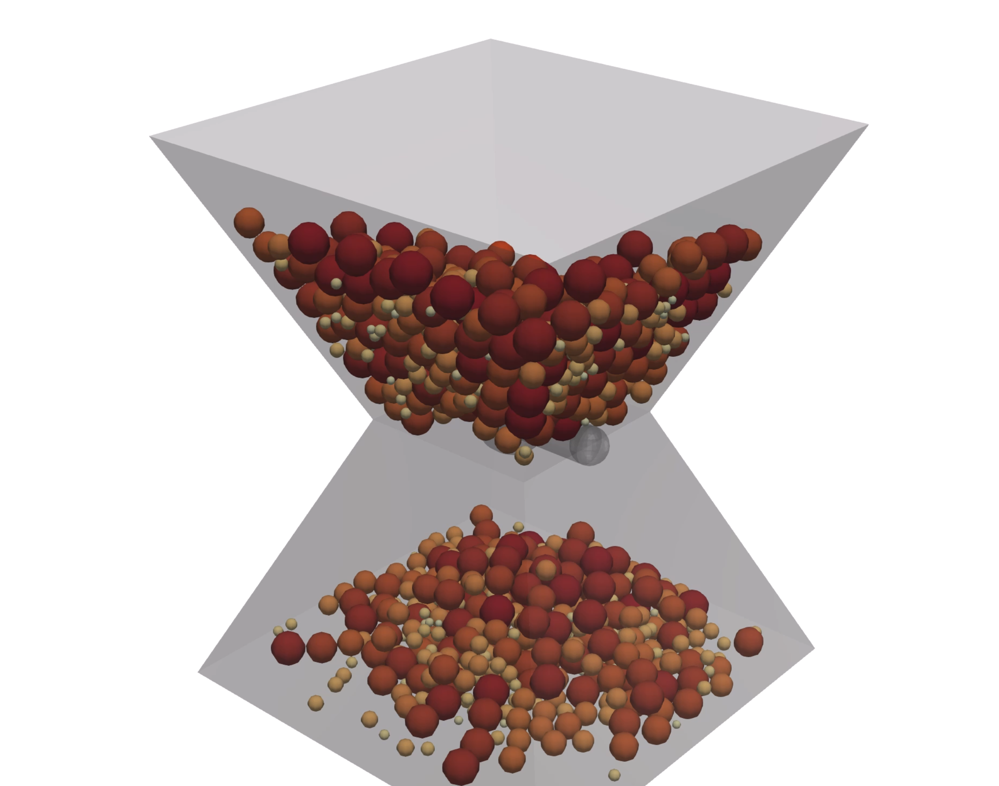

# TinyDEM

Author:
Dr. Roman Vetter (vetterro@ethz.ch)

本リポジトリでは、`tinydem.cpp` と `tinydem.hpp` を **Intel oneAPI (icx)** で実行できるように opendemjapan が修正しています。

## 内容

* `tinydem.hpp` - C++11 ヘッダ (データ構造、距離計算、I/O)
* `tinydem.cpp` - C++11 ソース (物理モデル、パラメータ、シミュレーションループ)
* `mesh.off` - サンプルメッシュ (デフォルトの砂時計形状)
* `csv_to_vtk.py` - CSV 出力を VTK へ変換するスクリプト
* `off_to_stl.py` - OFF を STL へ変換するスクリプト
* `README.md` - この説明
* `LICENSE` - BSD 3-Clause ライセンス

## コンパイル (Windows + oneAPI + PowerShell)

PowerShell で以下を実行します。`setvars` は oneAPI の環境設定スクリプトです。

```pwsh
setvars
icx /Qopenmp /O2 /std:c++11 /EHsc tinydem.cpp /Fe:tinydem.exe
```

`/Qopenmp` を外すとシリアル実行になります。

## 実行

`tinydem.cpp` 内のパラメータを必要に応じて変更したら、コンパイル後に実行します。

```pwsh
$env:OMP_NUM_THREADS=8
.\tinydem.exe mesh.off input.csv output
```

引数は以下の順で、いずれも省略可能です。

* 1つ目: OFF 形式メッシュ (`mesh.off`)
* 2つ目: 初期粒子 CSV
* 3つ目: 出力ディレクトリ

デフォルト実行は次の通りです。

```pwsh
$env:OMP_NUM_THREADS=8
.\tinydem.exe mesh.off
```

## 入力

1つ目の引数には GeomView の OFF 形式メッシュを指定します。
各面定義の末尾に整数インデックスを追加すると、`mesh.off` 内の半径リストの参照先として使われます (省略時は 0)。

2つ目の引数は初期粒子 CSV です。形式はプログラムが出力する CSV と同じです。
省略した場合でも、スポーン機構により粒子が生成されます。

## 出力と可視化

3つ目の引数に出力ディレクトリを指定できます。未指定の場合は `output` が作成されます。
出力はフレームごとの CSV で、既存データは上書きされます。各フレームで 1 行のステータスが表示されます。

CSV は付属の Python スクリプトで VTK に変換し、その `.vtk` を ParaView で可視化してください。

```pwsh
py .\csv_to_vtk.py output
```

変換後の `particles*.vtk` を ParaView で開きます。

## デモ動画

<video src="anime.mp4" controls></video>

## 画像



## ライセンス

本ソースコードは BSD 3-Clause ライセンスです (詳細は `LICENSE` を参照)。
ライセンスの範囲内で opendemjapan が oneAPI 向け修正を行っています。
